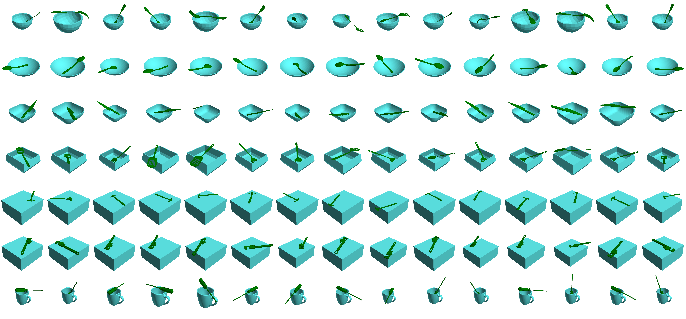

# ReGrasp

### Learning to Regrasp by Learning to Place, CoRL 2021.

## Introduction
We propose a point-cloud-based system for robots to predict a sequence of pick-and-place operations for transforming an initial object grasp pose to the desired object grasp poses. We introduce a new and challenging synthetic dataset for learning and evaluating the proposed approach. If you find this project useful for your research, please cite: 


```
@article{cheng2021learning,
  title={Learning to Regrasp by Learning to Place},
  author={Cheng, Shuo and Mo, Kaichun and Shao, Lin},
  journal={arXiv preprint arXiv:2109.08817},
  year={2021}
}

```
Real-world regrasping demo:


## How to Use

### Environment
* python 3.8 (Anaconda)
* ``pip install -r requirements.txt``

### Dataset
Visualization of sample stable poses:



please download the [dataset](https://drive.google.com/file/d/1UEw6RDHFCv-r5TBdV8dy486QT4x_big5/view?usp=sharing) and place it inside this folder.

### Reproducing Results

* Evaluating synthetic data: ``python scripts/evaluate_testset.py``
* Evaluating real data: ``bash scripts/test_real_data.sh``


### Test Your Own Data:
* Please organize your data in the ``real_data`` folder as the example provided
* Please make your data as clean and complete as possible since an offset ``(x_mean, y_mean, z_min)`` will be subtracted for centralizing the point cloud


### Training
* Train generator: ``bash scripts/train_pose_generation.sh``
* Train classifier: ``bash scripts/train_multi_task.sh``
